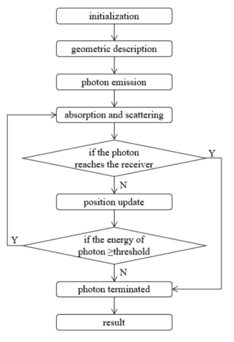
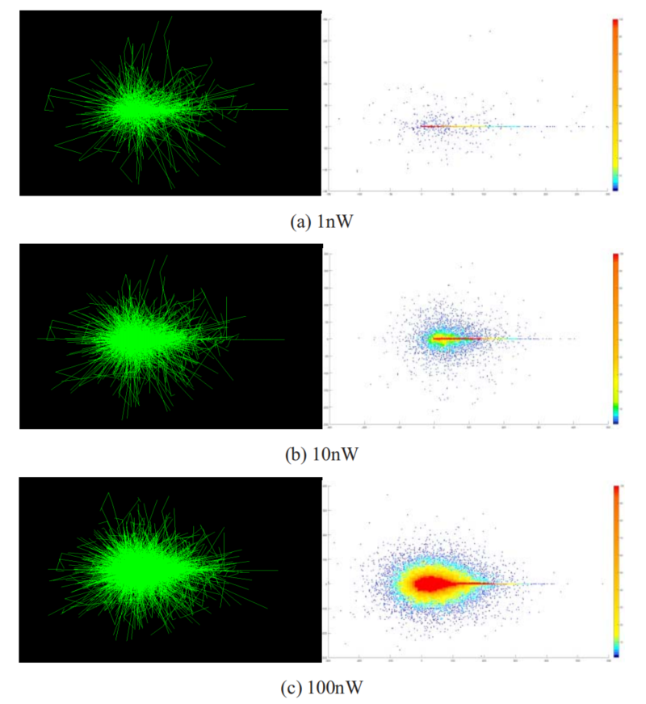
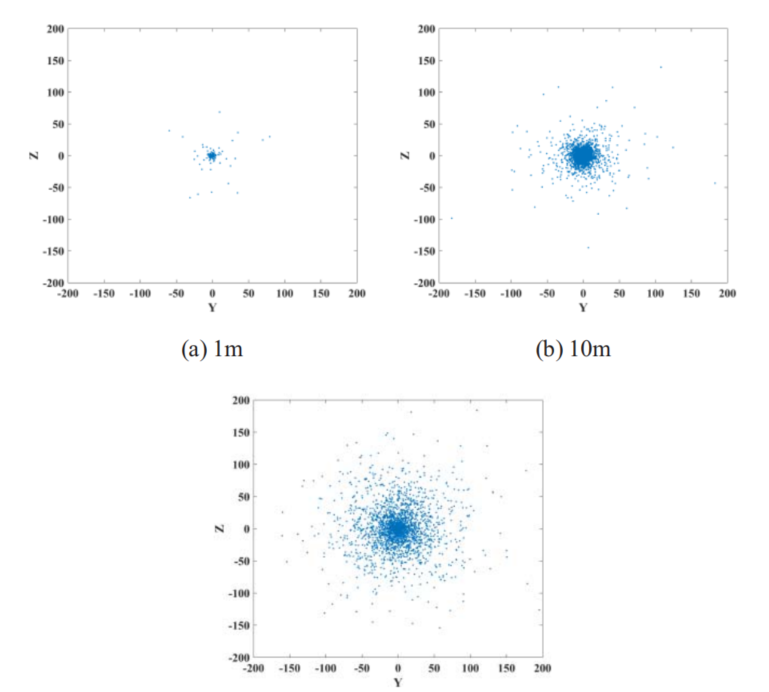
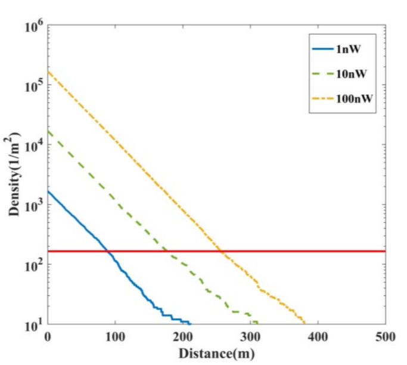
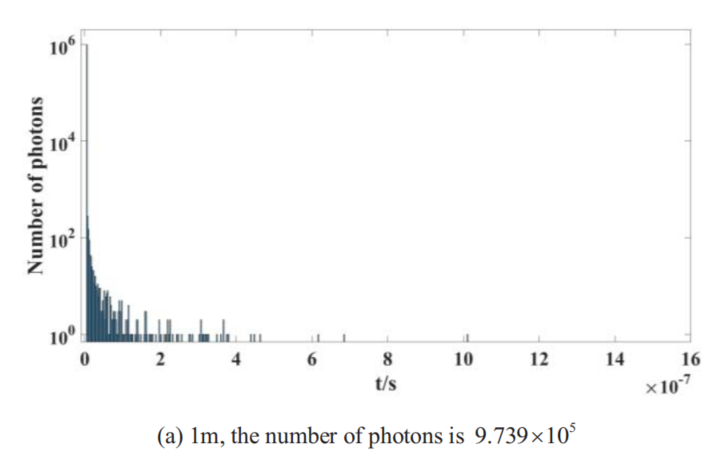
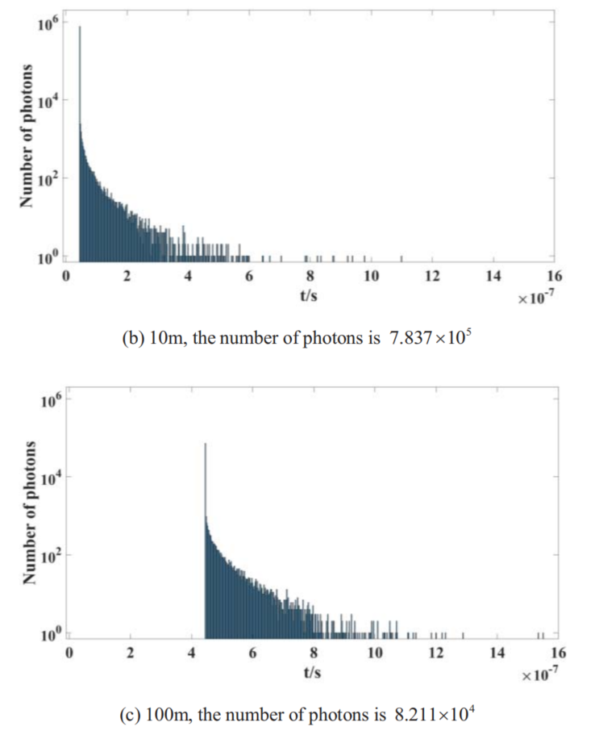

######  *W. Wang et al., "Simulation of Photon Distribution in Underwater Laser Communication," OCEANS 2018 MTS/IEEE Charleston, Charleston, SC, 2018, pp. 1-5.*

Wenshuang Wang, Min Fu*, Bing Zheng, Li Ma,  

Zhaorui Gu, Mengnan Sun  

Department of Electronic Engineering  

Ocean University of China  

# 论文解决的问题

与传统的水声通信相比，水下无线光通信具有高速、高带宽的优点。然而，信号强度和通信距离受海水吸收和散射，这将会引起的严重光衰减。

本文用Geant4模拟了特定波长的光子枪和纯海水的环境。仿真结果表明，当传输速率为1Mbps，信号波长为488 nm时，通信距离可超过100 m。

# 1.引言

近年来，水下光通信得到了飞速发展，目前，能够实现在水下短距离实现极高的数据传输率。但是，由于存在海水对光的吸收以及散射，实现水下激光通信系统的关键挑战是光子由于强散射而产生的时空分散。

 

# 2.理论

研究指出，光照强度的公式如下：
$$
I = I_0exp(-k_sz)
$$
其中，I~0~是原始光照强度，z是光传播的距离，k是衰减系数。

​	具体表示如下：
$$
k = a +(1+n)b
$$
其中a是吸收系数，b是散射系数。

# 3.仿真方法与工具

### 方法

The Monte Carlo method，蒙特卡罗方法，又称随机模拟法。在蒙特卡罗模拟中，激光束被视为一组虚拟光子或光子包，它们的传播路径被概率地模拟。传输过程中光子的数据。根据信道模型，如初始位置、运动轨迹、运动距离等，采用蒙特卡罗方法进行计算。

### 工具

GEANT4 (GEometry AND Tracking) 一个工具包，基于C++开发的开源蒙特卡罗模拟软件包对粒子轨迹进行仿真。在GEANT 4的仿真过程中，每个光子的每一步都被记录下来，直到光子被吸收，从而完整地表示了光子的传播路径。

#### 算法流程图

# 4.模型设计与环境初始化

### 水下环境模拟

2km * 2km * 2km的立方体，以立方体的中心为原点坐标，建立空间直角坐标系

根据海水成分，设置化学元素O，H，Cl，Na，Ca，Mg，K百分比。这些均匀分布的粒子被用来模拟一个纯海水环境

发射光束的波长为488 nm，传输速率为1Mbps，从坐标原点沿X轴的正方向发射，每个光子的初始能量为2.95eV

在GENANT4中设置好相关参数。

# 5.仿真结果与分析

光子枪发射三种光，传输速率为1Mbps

| 功率   | 1nw  | 10nw  | 100nw  |
| ------ | ---- | ----- | ------ |
| 光子数 | 2120 | 21200 | 212000 |

左边表示光子的传播路径，右边表示光子的吸收情况。直轴上的吸收光子数远大于其它位置，且直轴上吸收点与发射机之间的距离最大。它在里面结果表明，在纯水中，吸收引起的衰减大于散射，直接光的通信距离大于散射光。

结果表明，截面与发射器之间的距离越远，则越多的光子会由于散射而偏离直轴，光束的空间扩展越严重。。

**光子密度与透射距离的关系**

可以肯定的是，传输速率为1Mbps，信号波长为488nm，通信距离能够超过100m。

**时间分散的模拟**

以100万个光子为例，统计不同时间到达截面的光子数。图5显示了传输时间的统计数据。

X轴代表光子的数量，y轴代表光子到达横截面所需的时间。截面上的光子总数随着t的减少而减少。

显然，光子是同时发射的，但到达横截面的时间并不相同。

随着传输距离的增加，由多次散射引起的时间分散更加严重。

# 6.结论

本文在理论分析的基础上，利用GEANT 4和MATLAB对一种简单的水下激光通信结构进行了仿真。我们模拟了不同功率的光束传播。并从不同的角度模拟了水下光子的分布特征。仿真结果表明，传输速率为1Mbps，信号波长为488nm，通信距离可以超过100m。本文论证了水下中长距离激光通信的可行性，为水下中长距离激光通信提供了理论依据。为通信系统的建立奠定基础。